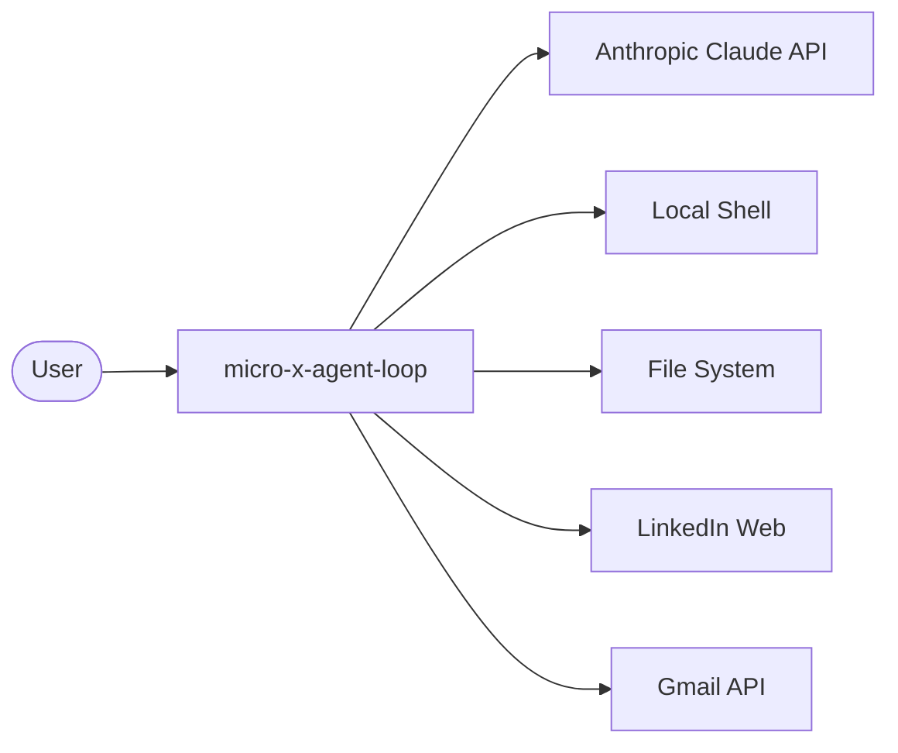
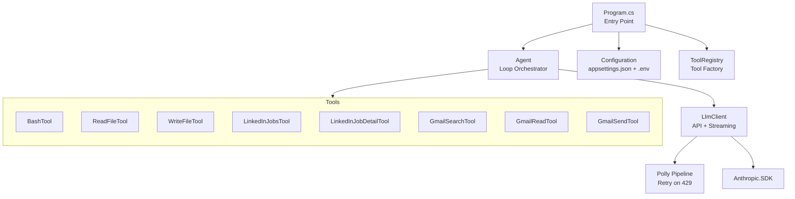
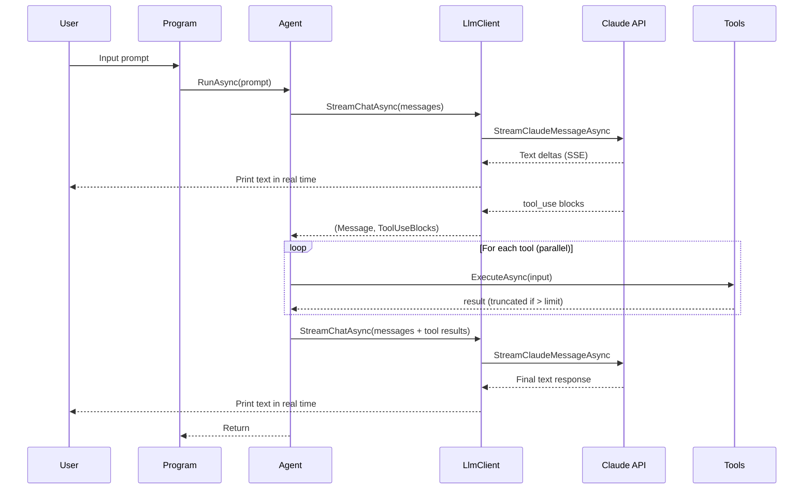

# Software Architecture Document

**Project:** micro-x-agent-loop-dotnet
**Version:** 1.0
**Last Updated:** 2026-02-15

## 1. Introduction and Goals

micro-x-agent-loop-dotnet is a minimal AI agent loop built with .NET 8 and the Anthropic Claude API. It provides a REPL interface where users type natural-language prompts and the agent autonomously calls tools to accomplish tasks.

### Key Goals

- Provide a simple, extensible agent loop for personal automation
- Support file operations, shell commands, job searching, and email
- Stream responses in real time for better user experience
- Keep the codebase small and easy to understand

### Stakeholders

| Role | Concern |
|------|---------|
| User | Natural-language task completion via tools |
| Developer | Easy to add new tools, understand the codebase |

## 2. Constraints

| Constraint | Rationale |
|-----------|-----------|
| .NET 8 | Target framework, cross-platform support |
| Anthropic Claude API | LLM provider for reasoning and tool dispatch |
| Console application | Simplicity; no web UI overhead |
| OAuth2 for Gmail | Required by Google API |

## 3. Context and Scope

### System Context



The agent sits between the user and external services. The user provides natural-language instructions; the agent uses Claude to decide which tools to call, executes them, and returns results.

### External Interfaces

| Interface | Protocol | Purpose |
|-----------|----------|---------|
| Anthropic API | HTTPS / SSE | LLM reasoning and tool dispatch |
| Gmail API | HTTPS / OAuth2 | Email search, read, send |
| LinkedIn | HTTPS / HTML scraping | Job search and detail fetching |
| Local shell | Process execution | Bash/cmd commands |
| File system | Direct I/O | Read/write files (.txt, .docx) |

## 4. Solution Strategy

| Decision | Approach |
|----------|----------|
| Agent loop | Iterative: send message, check for tool_use, execute tools, repeat |
| Streaming | `StreamClaudeMessageAsync` prints text deltas in real time |
| Resilience | Polly pipeline with exponential backoff for rate limits |
| Secrets | `.env` file loaded by DotNetEnv; never committed to git |
| App config | `appsettings.json` for non-secret settings |
| Tool extensibility | `ITool` interface; register in `ToolRegistry` |

## 5. Building Block View

### Level 1: Components



### Level 2: Key Classes

| Class | Responsibility |
|-------|---------------|
| `Program` | Entry point; loads config, builds tools, runs REPL |
| `Agent` | Manages conversation history, dispatches tool calls in parallel, enforces limits |
| `AgentConfig` | Immutable record holding all agent configuration |
| `LlmClient` | Wraps Anthropic SDK; streaming + Polly retry |
| `ToolRegistry` | Factory that assembles the tool list with dependencies |
| `ITool` | Interface: Name, Description, InputSchema, ExecuteAsync |
| `HtmlUtilities` | Shared HTML-to-plain-text conversion |
| `GmailAuth` | OAuth2 flow and token caching for Gmail |
| `GmailParser` | Base64url decoding, MIME parsing, text extraction |

## 6. Runtime View

### Agent Loop Sequence



### Conversation History Management

When the message list exceeds `MaxConversationMessages`, the oldest messages are removed and a warning is printed to stderr.

### Tool Result Truncation

When a tool result exceeds `MaxToolResultChars`, it is truncated and a message is appended:
```
[OUTPUT TRUNCATED: Showing 40,000 of 85,000 characters from read_file]
```
A warning is also printed to stderr.

## 7. Crosscutting Concepts

### Error Handling

- Tool execution errors are caught and returned as error text to Claude (not thrown)
- Unknown tool names return an error result
- API rate limits are retried automatically via Polly
- Unrecoverable errors propagate to the REPL catch block

### Security

- API keys stored in `.env`, loaded at startup, never logged
- `.env` is in `.gitignore`
- Gmail tokens stored in `.gmail-tokens/` (also gitignored)
- BashTool executes arbitrary commands (by design for agent autonomy)

### Configuration Layers

| Layer | Source | Purpose |
|-------|--------|---------|
| Secrets | `.env` | API keys (Anthropic, Google) |
| App settings | `appsettings.json` | Model, tokens, temperature, limits, paths |
| Defaults | Code | Fallback values when config is missing |

## 8. Architecture Decisions

See [Architecture Decision Records](decisions/README.md) for the full index.

| ADR | Title | Status |
|-----|-------|--------|
| [ADR-001](decisions/ADR-001-dotnetenv-for-secrets.md) | DotNetEnv for secrets management | Accepted |
| [ADR-002](decisions/ADR-002-polly-for-retry.md) | Polly for API retry resilience | Accepted |
| [ADR-003](decisions/ADR-003-streaming-responses.md) | Streaming responses via SSE | Accepted |

## 9. Risks and Technical Debt

| Risk | Impact | Mitigation |
|------|--------|-----------|
| LinkedIn HTML scraping is brittle | Job tools break when LinkedIn changes DOM | Multiple CSS selector fallbacks; accept degradation |
| No unit tests | Regressions go undetected | Future: add test project |
| Single Gmail account | Can't switch users without restart | Acceptable for personal use |
| BashTool has no sandboxing | Agent can execute any command | By design; user accepts risk |

## 10. Glossary

| Term | Definition |
|------|-----------|
| Agent loop | Iterative cycle: prompt -> LLM -> tool calls -> LLM -> response |
| Tool use | Claude's mechanism for requesting function execution |
| SSE | Server-Sent Events; used for streaming API responses |
| Rate limit | API throttling (HTTP 429); handled by Polly retry |
| REPL | Read-Eval-Print Loop; the interactive console interface |
