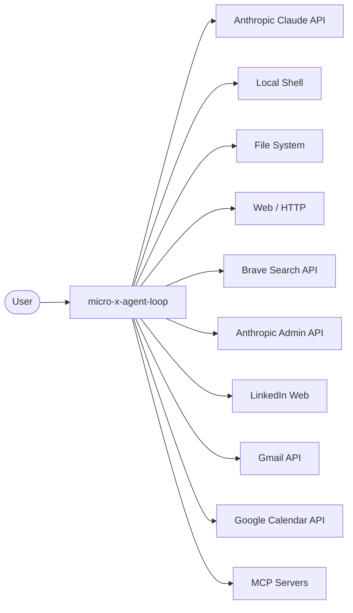
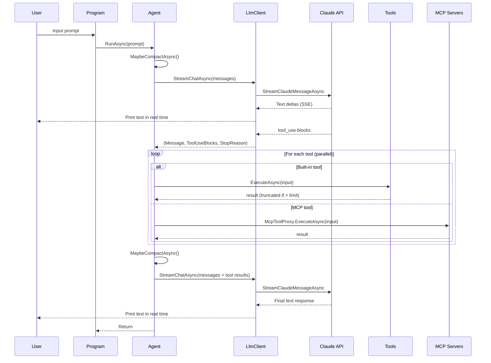
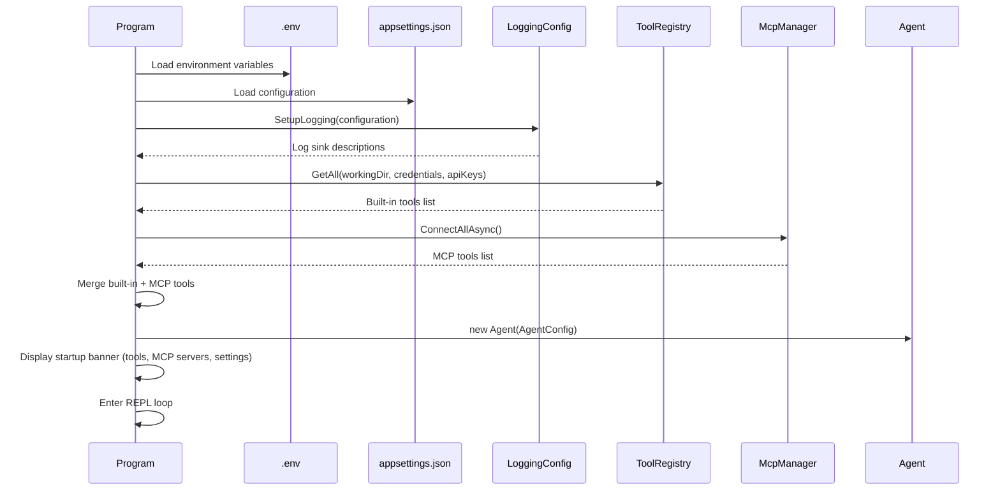

# Software Architecture Document

**Project:** micro-x-agent-loop-dotnet
**Version:** 2.0
**Last Updated:** 2026-02-19

## 1. Introduction and Goals

micro-x-agent-loop-dotnet is a minimal AI agent loop built with .NET 8 and the Anthropic Claude API. It provides a REPL interface where users type natural-language prompts and the agent autonomously calls tools to accomplish tasks. The agent supports built-in tools for file operations, shell commands, web access, and third-party integrations, as well as dynamically discovered tools from external MCP (Model Context Protocol) servers.

### Key Goals

- Provide a simple, extensible agent loop for personal automation
- Support file operations, shell commands, web browsing/search, job searching, email, calendar, and API usage reporting
- Extend the tool surface dynamically via MCP server connections (stdio and HTTP transports)
- Stream responses in real time for better user experience
- Manage long conversations through configurable compaction strategies
- Keep the codebase small and easy to understand

### Stakeholders

| Role | Concern |
|------|---------|
| User | Natural-language task completion via tools |
| Developer | Easy to add new tools, understand the codebase |

## 2. Constraints

| Constraint | Rationale |
|-----------|-----------|
| .NET 8 | Target framework, cross-platform support |
| Anthropic Claude API | LLM provider for reasoning and tool dispatch |
| Console application | Simplicity; no web UI overhead |
| OAuth2 for Gmail/Calendar | Required by Google API |
| Brave Search API | Web search requires a Brave API key (conditional registration) |
| Anthropic Admin API | Usage/cost reporting requires an admin API key (conditional registration) |
| MCP protocol (stdio + HTTP) | External tool servers must implement the Model Context Protocol |

## 3. Context and Scope

### System Context



The agent sits between the user and external services. The user provides natural-language instructions; the agent uses Claude to decide which tools to call, executes them, and returns results. MCP servers extend the tool surface at runtime by exposing additional tools over stdio or HTTP transports.

### External Interfaces

| Interface | Protocol | Purpose |
|-----------|----------|---------|
| Anthropic Messages API | HTTPS / SSE | LLM reasoning and tool dispatch |
| Anthropic Admin API | HTTPS | Organization usage and cost reports |
| Brave Search API | HTTPS | Web search results |
| Gmail API | HTTPS / OAuth2 | Email search, read, send |
| Google Calendar API | HTTPS / OAuth2 | Calendar event listing, creation, retrieval |
| LinkedIn | HTTPS / HTML scraping | Job search and detail fetching |
| Web (general) | HTTP / HTTPS | Fetch arbitrary URL content (HTML, JSON, text) |
| MCP servers | stdio / HTTP | Dynamically discovered external tools |
| Local shell | Process execution | Bash/cmd commands |
| File system | Direct I/O | Read/write/append files (.txt, .docx) |

## 4. Solution Strategy

| Decision | Approach |
|----------|----------|
| Agent loop | Iterative: send message, check for tool_use, execute tools, repeat |
| Streaming | `StreamChatAsync` prints text deltas in real time with a spinner while waiting |
| Resilience | Polly pipeline with exponential backoff for rate limits (HTTP 429) |
| Secrets | `.env` file loaded by DotNetEnv; never committed to git |
| App config | `appsettings.json` for non-secret settings (model, tokens, compaction, logging, MCP servers) |
| Tool extensibility | `ITool` interface; built-in tools registered in `ToolRegistry`, MCP tools discovered dynamically |
| MCP integration | `McpManager` connects to configured servers; `McpToolProxy` adapts each MCP tool to `ITool` |
| Conversation compaction | `ICompactionStrategy` interface with `SummarizeCompactionStrategy` (LLM-based summarization) and `NoneCompactionStrategy` (no-op) |
| Structured logging | Serilog with configurable console (stderr) and file sinks via `LoggingConfig` |
| Conditional tools | `WebSearchTool`, `AnthropicUsageTool`, Gmail, and Calendar tools are only registered when their respective API keys/credentials are present |

## 5. Building Block View

### Level 1: Components

```mermaid
graph TD
    Program[Program.cs<br/>Entry Point] --> Agent[Agent<br/>Loop Orchestrator]
    Program --> Config[Configuration<br/>appsettings.json + .env]
    Program --> Registry[ToolRegistry<br/>Tool Factory]
    Program --> Logging[LoggingConfig<br/>Serilog Setup]
    Program --> McpMgr[McpManager<br/>MCP Connections]

    Agent --> LlmClient[LlmClient<br/>API + Streaming]
    Agent --> Compaction[ICompactionStrategy<br/>History Management]
    Agent --> Tools[ITool Implementations]

    LlmClient --> Polly[Polly Pipeline<br/>Retry on 429]
    LlmClient --> Anthropic[Anthropic.SDK]

    McpMgr --> McpProxy[McpToolProxy<br/>ITool Adapter]

    subgraph "Built-in Tools"
        direction TB
        Bash[BashTool]
        ReadFile[ReadFileTool]
        WriteFile[WriteFileTool]
        AppendFile[AppendFileTool]
        WebFetch[WebFetchTool]
        WebSearch[WebSearchTool]
        AnthUsage[AnthropicUsageTool]
        LI1[LinkedInJobsTool]
        LI2[LinkedInJobDetailTool]
        Gmail1[GmailSearchTool]
        Gmail2[GmailReadTool]
        Gmail3[GmailSendTool]
        Cal1[CalendarListEventsTool]
        Cal2[CalendarCreateEventTool]
        Cal3[CalendarGetEventTool]
    end

    subgraph "Web Abstraction"
        direction TB
        ISearch[ISearchProvider]
        Brave[BraveSearchProvider]
        ISearch --> Brave
    end

    WebSearch --> ISearch
```



### Level 2: Key Classes

| Class | Responsibility |
|-------|---------------|
| `Program` | Entry point; loads config, sets up logging, builds tools, connects MCP servers, runs REPL |
| `Agent` | Manages conversation history, dispatches tool calls in parallel, enforces limits, triggers compaction |
| `AgentConfig` | Immutable record holding all agent configuration |
| `LlmClient` | Wraps Anthropic SDK; streaming with spinner + Polly retry |
| `ToolRegistry` | Factory that assembles the built-in tool list with dependencies; conditionally registers tools based on available API keys |
| `ITool` | Interface: Name, Description, InputSchema, ExecuteAsync |
| `LoggingConfig` | Configures Serilog sinks (console to stderr, file with rotation) from `appsettings.json` |
| `McpManager` | Connects to all configured MCP servers (stdio or HTTP transport), discovers tools, manages client lifetimes |
| `McpToolProxy` | Adapter that wraps an MCP tool definition + client into an `ITool`; prefixes tool names as `server__tool` |
| `McpServerConfig` | Configuration record for a single MCP server (transport, command, args, env, url) |
| `ICompactionStrategy` | Interface for conversation history compaction strategies |
| `SummarizeCompactionStrategy` | LLM-based summarization of older messages when token count exceeds threshold |
| `NoneCompactionStrategy` | No-op strategy; conversation is only trimmed by message count |
| `WebFetchTool` | Fetches URL content; converts HTML to plain text, pretty-prints JSON, truncates to configurable limit |
| `WebSearchTool` | Web search via an `ISearchProvider`; returns ranked results with titles, URLs, descriptions |
| `ISearchProvider` | Abstraction for web search backends |
| `BraveSearchProvider` | Brave Search API implementation of `ISearchProvider` |
| `AnthropicUsageTool` | Queries Anthropic Admin API for usage, cost, and Claude Code reports; converts cost amounts from cents to USD |
| `HtmlUtilities` | Shared HTML-to-plain-text conversion |
| `GmailAuth` / `CalendarAuth` | OAuth2 flow and token caching for Google APIs |
| `GmailParser` | Base64url decoding, MIME parsing, text extraction |

## 6. Runtime View

### Agent Loop Sequence



### Startup Sequence



### Conversation Compaction

When the `SummarizeCompactionStrategy` is active, compaction is checked before each LLM call:

1. Estimate total token count across all messages (chars / 4 heuristic)
2. If below `CompactionThresholdTokens`, do nothing
3. Otherwise, identify compactable messages (excluding the first user message and the last N protected tail messages)
4. Adjust the compaction boundary to avoid splitting tool_use / tool_result pairs
5. Send the compactable messages to the LLM with a summarization prompt
6. Replace the compacted range with a `[CONTEXT SUMMARY]` block appended to the first user message
7. Insert an assistant acknowledgment if needed for role alternation

### Conversation History Trimming

After compaction, if the message list still exceeds `MaxConversationMessages`, the oldest messages are removed and a note is printed to stderr.

### Tool Result Truncation

When a tool result exceeds `MaxToolResultChars`, it is truncated and a message is appended:
```
[OUTPUT TRUNCATED: Showing 40,000 of 85,000 characters from read_file]
```
A warning is also printed to stderr.

### max_tokens Recovery

If the LLM response is cut off with a `max_tokens` stop reason and no tool calls are pending, the agent automatically asks the LLM to continue more concisely. This is retried up to 3 times before giving up.

## 7. Crosscutting Concepts

### Error Handling

- Tool execution errors are caught and returned as error text to Claude (not thrown to the REPL)
- `McpToolProxy` throws `InvalidOperationException` on MCP tool errors, which `Agent` catches and returns as an error result
- Unknown tool names return an error result
- API rate limits are retried automatically via Polly (up to 5 attempts, exponential backoff from 10s)
- Compaction failures fall back gracefully to no compaction with a warning
- Unrecoverable errors propagate to the REPL catch block

### Security

- API keys stored in `.env`, loaded at startup, never logged
- `.env` is in `.gitignore`
- Gmail/Calendar tokens stored in `.gmail-tokens/` (also gitignored)
- `BashTool` executes arbitrary commands (by design for agent autonomy)
- `WebFetchTool` enforces a 2 MB response size limit and 30s timeout
- MCP server environment variables are configured in `appsettings.json`, not in `.env`

### Structured Logging

Logging is managed by Serilog, configured through `LoggingConfig`:

| Sink | Output | Template |
|------|--------|----------|
| Console | stderr | `HH:mm:ss [LVL] SourceContext: Message` |
| File | Configurable path (default `agent.log`) | `yyyy-MM-dd HH:mm:ss.fff [LVL] SourceContext:MemberName:LineNumber - Message` |

- File sink rolls at 10 MB with up to 3 retained files
- Log level is configurable via `LogLevel` in `appsettings.json`
- Per-sink log levels can be overridden in `LogConsumers` entries
- If no `LogConsumers` are configured, both console and file sinks are created with the global level

### Configuration Layers

| Layer | Source | Purpose |
|-------|--------|---------|
| Secrets | `.env` | API keys: `ANTHROPIC_API_KEY`, `GOOGLE_CLIENT_ID`, `GOOGLE_CLIENT_SECRET`, `ANTHROPIC_ADMIN_API_KEY`, `BRAVE_API_KEY` |
| App settings | `appsettings.json` | Model, tokens, temperature, limits, paths, compaction, logging, MCP servers |
| Defaults | Code | Fallback values when config is missing |

### Configuration Reference

| Setting | Type | Default | Purpose |
|---------|------|---------|---------|
| `Model` | string | `claude-sonnet-4-5-20250929` | Anthropic model ID |
| `MaxTokens` | int | `8192` | Maximum tokens per LLM response |
| `Temperature` | decimal | `1.0` | Sampling temperature |
| `MaxToolResultChars` | int | `40000` | Truncation limit for tool output |
| `MaxConversationMessages` | int | `50` | Hard cap on conversation history length |
| `WorkingDirectory` | string | _(none)_ | Base directory for BashTool, ReadFileTool, WriteFileTool, AppendFileTool |
| `CompactionStrategy` | string | `none` | Compaction strategy: `none` or `summarize` |
| `CompactionThresholdTokens` | int | `80000` | Estimated token count that triggers compaction |
| `ProtectedTailMessages` | int | `6` | Number of recent messages excluded from compaction |
| `LogLevel` | string | `Information` | Global minimum log level |
| `LogConsumers` | array | _(default sinks)_ | Array of sink configs: `{ "type": "console"\|"file", "level": "...", "path": "..." }` |
| `McpServers` | object | _(none)_ | Map of server name to `McpServerConfig` (transport, command, args, env, url) |

### MCP Integration

MCP (Model Context Protocol) support allows the agent to dynamically discover and use tools from external servers:

- **Configuration**: MCP servers are declared in `appsettings.json` under the `McpServers` key, each with a name and transport configuration
- **Transports**: `stdio` (launches a child process) and `http` (connects to a running HTTP endpoint)
- **Discovery**: `McpManager.ConnectAllAsync()` connects to each server and calls `ListToolsAsync()` to discover available tools
- **Adaptation**: Each discovered MCP tool is wrapped in a `McpToolProxy` that implements `ITool`, with the tool name prefixed as `serverName__toolName` to avoid collisions
- **Lifecycle**: `McpManager` implements `IAsyncDisposable` and cleanly shuts down all MCP client connections on exit
- **Error handling**: If a server fails to connect, an error is logged and the remaining servers are still initialized

### Conditional Tool Registration

Several tools are only registered when their required credentials are available:

| Tool(s) | Required Environment Variable(s) |
|---------|----------------------------------|
| `WebSearchTool` | `BRAVE_API_KEY` |
| `AnthropicUsageTool` | `ANTHROPIC_ADMIN_API_KEY` |
| Gmail tools (search, read, send) | `GOOGLE_CLIENT_ID` + `GOOGLE_CLIENT_SECRET` |
| Calendar tools (list, create, get) | `GOOGLE_CLIENT_ID` + `GOOGLE_CLIENT_SECRET` |

Tools that are always registered: `BashTool`, `ReadFileTool`, `WriteFileTool`, `AppendFileTool`, `LinkedInJobsTool`, `LinkedInJobDetailTool`, `WebFetchTool`.

## 8. Architecture Decisions

See [Architecture Decision Records](decisions/README.md) for the full index.

| ADR | Title | Status |
|-----|-------|--------|
| [ADR-001](decisions/ADR-001-dotnetenv-for-secrets.md) | DotNetEnv for secrets management | Accepted |
| [ADR-002](decisions/ADR-002-polly-for-retry.md) | Polly for API retry resilience | Accepted |
| [ADR-003](decisions/ADR-003-streaming-responses.md) | Streaming responses via SSE | Accepted |

Key architectural decisions not yet captured in ADRs:

- **MCP for extensibility**: Rather than building every integration as a built-in tool, the agent supports MCP servers for dynamic tool discovery. This allows external tools to be developed and deployed independently.
- **Serilog for structured logging**: Chosen for its rich sink ecosystem and structured logging support. Console output goes to stderr to avoid mixing with agent responses on stdout.
- **ISearchProvider abstraction**: Web search is accessed through an interface, making it straightforward to swap Brave for another search provider without changing the tool layer.
- **ICompactionStrategy abstraction**: Compaction is pluggable. The `SummarizeCompactionStrategy` uses the same LLM to summarize older messages, while `NoneCompactionStrategy` is a no-op fallback.

## 9. Risks and Technical Debt

| Risk | Impact | Mitigation |
|------|--------|-----------|
| LinkedIn HTML scraping is brittle | Job tools break when LinkedIn changes DOM | Multiple CSS selector fallbacks; accept degradation |
| No unit tests | Regressions go undetected | Future: add test project |
| Single Gmail/Calendar account | Can't switch users without restart | Acceptable for personal use |
| BashTool has no sandboxing | Agent can execute any command | By design; user accepts risk |
| MCP server failures at startup | Some tools unavailable | Errors are logged; remaining servers still connect; agent runs with reduced tool set |
| WebFetchTool can access internal network | Potential SSRF if agent is exposed externally | Currently single-user console app; not a concern for personal use |
| Token estimation is approximate | Compaction may trigger too early or too late | chars/4 heuristic is intentionally conservative; threshold is configurable |
| Brave Search API rate limits | Web search may fail under heavy use | Errors returned to LLM as text; LLM can adapt or retry |
| MCP tool name collisions | Two servers could expose identically-named tools | Mitigated by `serverName__toolName` prefix convention |

## 10. Glossary

| Term | Definition |
|------|-----------|
| Agent loop | Iterative cycle: prompt -> LLM -> tool calls -> LLM -> response |
| Tool use | Claude's mechanism for requesting function execution |
| SSE | Server-Sent Events; used for streaming API responses |
| Rate limit | API throttling (HTTP 429); handled by Polly retry |
| REPL | Read-Eval-Print Loop; the interactive console interface |
| MCP | Model Context Protocol; an open standard for connecting AI agents to external tool servers |
| Compaction | Reducing conversation history size by summarizing older messages to stay within token limits |
| Protected tail | The most recent N messages excluded from compaction to preserve current context |
| Working directory | Configurable base path for file and shell operations |
| Conditional tool | A tool that is only registered when its required API key or credential is present at startup |
