# micro-x-agent-loop-dotnet Documentation

Central navigation hub for all project documentation.

## Quick Start

- [Getting Started](operations/getting-started.md) - Setup, prerequisites, first run

## Architecture

- [Software Architecture Document](architecture/SAD.md) - System overview, components, data flow
- [Architecture Decision Records](architecture/decisions/README.md) - Index of all ADRs

## Design

- [Agent Loop Design](design/DESIGN-agent-loop.md) - Core agent loop, tool dispatch, streaming, compaction
- [Tool System Design](design/DESIGN-tool-system.md) - Tool interface, registry, built-in tools, MCP integration
- [Compaction Design](design/DESIGN-compaction.md) - LLM-based conversation summarization strategy
- [Map-Evaluate Pattern](design/DESIGN-map-evaluate-pattern.md) - Isolated scoring for criteria matching workflows
- [Account Management APIs](design/DESIGN-account-management-apis.md) - Anthropic/OpenAI admin API catalog

## Planning

- [Web Fetch Tool](planning/PLAN-web-fetch-tool.md) - Phase 1: URL content fetching (completed)
- [Web Search Tool](planning/PLAN-web-search-tool.md) - Phase 2: Brave Search integration (completed)
- [Browser Automation](planning/PLAN-browser-automation.md) - Phase 3: Playwright browser tool (planned)
- [Claude-Style Memory](planning/PLAN-claude-style-memory.md) - Session persistence, checkpoints, rewind
- [WhatsApp Contact Names](planning/PLAN-whatsapp-contact-names.md) - Fix name resolution in WhatsApp MCP (completed)

## Tools

Individual tool documentation:

- [bash](design/tools/bash/README.md) - Shell command execution
- [read_file](design/tools/read-file/README.md) - File reading (text + .docx)
- [write_file](design/tools/write-file/README.md) - File writing
- [linkedin_jobs](design/tools/linkedin-jobs/README.md) - LinkedIn job search
- [linkedin_job_detail](design/tools/linkedin-job-detail/README.md) - LinkedIn job details
- [gmail_search](design/tools/gmail-search/README.md) - Gmail search
- [gmail_read](design/tools/gmail-read/README.md) - Gmail message reading
- [gmail_send](design/tools/gmail-send/README.md) - Gmail sending
- [calendar_list_events](design/tools/calendar-list-events/README.md) - Calendar event listing
- [calendar_create_event](design/tools/calendar-create-event/README.md) - Calendar event creation
- [calendar_get_event](design/tools/calendar-get-event/README.md) - Calendar event details
- [contacts_search](design/tools/contacts-search/README.md) - Contacts search
- [contacts_list](design/tools/contacts-list/README.md) - Contacts listing
- [contacts_get](design/tools/contacts-get/README.md) - Contact details
- [contacts_create](design/tools/contacts-create/README.md) - Contact creation
- [contacts_update](design/tools/contacts-update/README.md) - Contact updates
- [contacts_delete](design/tools/contacts-delete/README.md) - Contact deletion
- [anthropic_usage](design/tools/anthropic-usage/README.md) - Anthropic Admin API reports
- [whatsapp-mcp](design/tools/whatsapp-mcp/README.md) - WhatsApp MCP server

## Examples

- [Example Prompts](examples/README.md) - Working prompt templates for common tasks

## Operations

- [Getting Started](operations/getting-started.md) - Prerequisites, setup, running
- [Configuration Reference](operations/appsettings.md) - All settings with types and defaults
- [Troubleshooting](operations/troubleshooting.md) - Common issues and solutions

## Document Map

```mermaid
graph TD
    INDEX[index.md] --> SAD[SAD.md]
    INDEX --> ADR[ADR Index]
    INDEX --> DESIGN1[Agent Loop Design]
    INDEX --> DESIGN2[Tool System Design]
    INDEX --> DESIGN3[Compaction Design]
    INDEX --> DESIGN4[Map-Evaluate Pattern]
    INDEX --> DESIGN5[Account Management APIs]
    INDEX --> PLAN[Planning Docs]
    INDEX --> TOOLS[Tool READMEs]
    INDEX --> EXAMPLES[Examples]
    INDEX --> OPS1[Getting Started]
    INDEX --> OPS2[Configuration]
    INDEX --> OPS3[Troubleshooting]

    ADR --> ADR001[ADR-001: DotNetEnv for Secrets]
    ADR --> ADR002[ADR-002: Polly for Retry]
    ADR --> ADR003[ADR-003: Streaming Responses]
    ADR --> ADR004[ADR-004: MCP Integration]
    ADR --> ADR005[ADR-005: Serilog for Logging]
    ADR --> ADR006[ADR-006: Separate MCP Repos]
    ADR --> ADR007[ADR-007: Google Contacts Tools]

    SAD --> DESIGN1
    SAD --> DESIGN2
    SAD --> DESIGN3
    OPS2 --> OPS3
```

